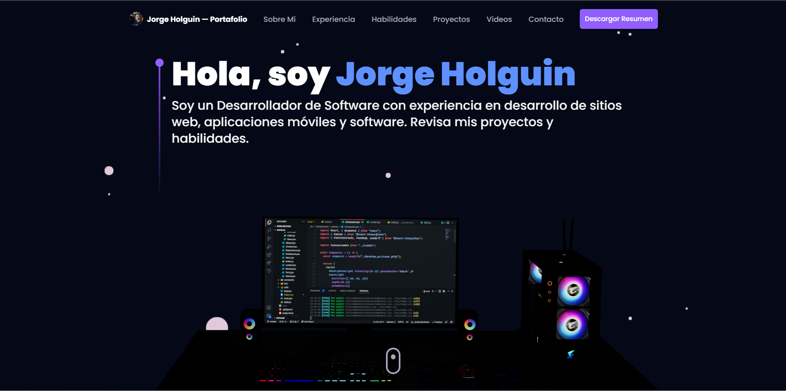

<!-- GitHub badges -->

[](https://github.com/jorge-holguin/jorge-holguin.github.io/releases/tag/V1.0)
[](https://github.com/jorge-holguin/jorge-holguin.github.io/stargazers)
[](https://github.com/jorge-holguin/jorge-holguin.github.io/forks)
[](https://github.com/jorge-holguin/jorge-holguin.github.io/commits)
[](https://github.com/jorge-holguin/jorge-holguin.github.io/pulls)



[](https://github.com/jorge-holguin)
[](https://github.com/jorge-holguin/jorge-holguin.github.io/blob/main/LICENSE)
[](https://www.typescriptlang.org/)


[](https://snyk.io/test/github/jorge-holguin/jorge-holguin.github.io)

## 🌐 Demo en Vivo

Explora la demostración en vivo del proyecto:
[Portafolio 3D](https://jorge-holguin.github.io/)

## 📝 Descripción

**Portafolio 3D** es un sitio web de portafolio bien diseñado y completamente funcional, construido con React.js y Three.js. Es un sitio web totalmente responsivo que funciona bien en todos los dispositivos.

<details><summary><b>Estructura de Carpetas</b></summary>

```bash
3d-portfolio/
├── src/
├   ├── App.tsx
├   ├── globals.css
├   ├── main.tsx
├   ├── vite.env.d.ts
├   ├── components/
├   ├   ├── atoms/
├   ├   ├   └── Header.tsx
├   ├   ├── canvas/
├   ├   ├   ├── Ball.tsx
├   ├   ├   ├── Computers.tsx
├   ├   ├   ├── Earth.tsx
├   ├   ├   ├── Stars.tsx
├   ├   ├   └── index.ts
├   ├   ├── layout/
├   ├   ├   ├── Loader.tsx
├   ├   ├   └── Navbar.tsx
├   ├   ├── sections/
├   ├   ├   ├── About.tsx
├   ├   ├   ├── Contact.tsx
├   ├   ├   ├── Experience.tsx
├   ├   ├   ├── Footer.tsx
├   ├   ├   ├── Hero.tsx
├   ├   ├   ├── Tech.tsx
├   ├   ├   ├── Works.tsx
├   ├   ├   └── page.tsx
├   ├   └── index.ts
├   ├── constants/
├   ├   ├── config.ts
├   ├   ├── styles.ts
├   ├   └── index.ts
├   ├── hoc/
├   ├   ├── SectionWrapper.tsx
├   ├   └── index.ts
├   ├── utils/
├   ├   └── motion.ts
├   ├── types/
├   ├   └── index.d.ts
├   └── assets/
├       ├── company/
├       ├   └── [[...]].{svg,png}
├       ├── tech/
├       ├   └── [[...]].{svg,png}
├       ├── [[...]].{svg,png}
├       └── index.ts
├── public/
├   ├── desktop_pc
├   ├   ├── textures/[[...]].png
├   ├   ├── license.txt
├   ├   ├── scene.bin
├   ├   └── scene.gltf
├   ├── planet
├   ├   ├── textures/[[...]].png
├   ├   ├── license.txt
├   ├   ├── scene.bin
├   ├   └── scene.gltf
├   ├── logo.png
├   └── logo.svg
├── .env
├── .eslintignore
├── .eslintrc.cjs
├── .gitignore
├── .prettierignore
├── .prettierrc.cjs
├── index.html
├── LICENSE
├── README.md
├── package.json
├── postcss.config.cjs
├── tailwind.config.cjs
├── tsconfig.json
├── tsconfig.node.json
└── vite.config.js
```

</details>

## 📖 Tabla de Contenidos

<details><summary>Tabla de Contenidos</summary>

- [🌐 Demo en Vivo](#-demo-en-vivo)
- [📝 Descripción](#-descripción)
- [📖 Tabla de Contenidos](#-tabla-de-contenidos)
- [👨‍💻 Tecnologías Utilizadas](#-tecnologías-utilizadas)
- [✅ Cómo Empezar](#-cómo-empezar)
  - [📋 Requisitos Previos](#-requisitos-previos)
  - [⚙️ Instalación y Ejecución Local](#️-instalación-y-ejecución-local)
  - [📄 Scripts](#-scripts)
- [🔒 Variables de Entorno](#-variables-de-entorno)
- [🚀 Despliegue](#-despliegue)
    - [Despliegue a Producción (manual)](#despliegue-a-producción-manual)
    - [Despliegue en Github Pages](#despliegue-en-github-pages)
    - [Despliegue en Vercel (recomendado)](#despliegue-en-vercel-recomendado)
    - [Despliegue en Netlify](#despliegue-en-netlify)
- [⚒️ Contribuciones](#️-contribuciones)
  - [🐞 Bug / Solicitud de Funcionalidades](#-bug--solicitud-de-funcionalidades)
- [📱 Contacto](#-contacto)
- [📋 Licencia](#-licencia)

</details>

## 👨‍💻 Tecnologías Utilizadas

<details><summary><b>Portafolio 3D</b> está construido usando las siguientes tecnologías:</summary>

- [TypeScript](https://www.typescriptlang.org/): TypeScript es un superconjunto tipado de JavaScript que se compila a JavaScript plano.
- [Vite](https://vitejs.dev/): Vite es una herramienta de construcción que tiene como objetivo proporcionar una experiencia de desarrollo más rápida y ligera para proyectos web modernos.
- [React.js](https://reactjs.org/): React es una biblioteca de JavaScript de front-end gratuita y de código abierto para construir interfaces de usuario o componentes de UI.
- [Three.js](https://threejs.org/): Three.js es una biblioteca de JavaScript multiplataforma y una interfaz de programación de aplicaciones utilizada para crear y mostrar gráficos 3D animados en un navegador web usando WebGL.
- [Framer Motion](https://www.framer.com/motion/): Framer Motion es una biblioteca de animación lista para producción para React.
- [Tailwind CSS](https://tailwindcss.com/): Tailwind CSS es un framework de CSS basado en utilidades para construir rápidamente interfaces de usuario personalizadas.
- [ESLint](https://eslint.org/): ESLint es una herramienta de análisis de código estático para identificar patrones problemáticos encontrados en el código JavaScript.
- [Prettier](https://prettier.io/): Prettier es un formateador de código opinado.
</details>
<br/>

[](https://skillicons.dev)

## ✅ Cómo Empezar

Para poner en marcha este proyecto en tu entorno de desarrollo, sigue estas instrucciones paso a paso.

### 📋 Requisitos Previos

Para instalar y ejecutar este proyecto localmente, necesitas tener instalados los siguientes programas en tu máquina local.

- [Node.js](https://nodejs.org/en/)
- [NPM](https://www.npmjs.com/get-npm)
- [Git](https://git-scm.com/downloads)

### ⚙️ Instalación y Ejecución Local

**Paso 0:**

Nota: la aplicación utiliza EmailJS para enviar correos electrónicos desde el lado del cliente, por lo tanto, necesitas crear una cuenta en EmailJS aquí y configurar las variables de entorno VITE_EMAILJS_SERVICE_ID, VITE_EMAILJS_TEMPLATE_ID y VITE_EMAIL_JS_ACCESS_TOKEN en el archivo .env.

**Paso 1**

Descarga o clona este repositorio usando el siguiente enlace:

```bash
git clone https://github.com/jorge-holguin/jorge-holguin.github.io
```

**Paso 2:**

Ejecuta el siguiente comando en el directorio raíz del repositorio descargado para instalar las dependencias:

```bash
npm install
```

**Paso 3:**

Ejecuta el siguiente comando para iniciar el servidor de desarrollo localmente:

```bash
npm run dev
```

**Paso 4:**

Abre [http://localhost:5173](http://localhost:5173) en tu navegador para ver el resultado.

### 📄 Scripts

Todos los scripts están definidos en el archivo `package.json`. Aquí hay una lista de todos los scripts:

| Script             | Action                                      |
| :----------------- | :------------------------------------------ |
| `npm install`      | Instala las dependencias                    |
| `npm run dev`      | Inicia el servidor de desarrollo en `localhost:5137` |
| `npm run build`    | Construye el sitio de producción en `./dist/`|
| `npm run preview`  | Inicia un servidor web estático local        |
| `npm run lint`     | Ejecuta ESLint                               |
| `npm run ts:check` | Realiza una verificación de tipos            |

## 🔒 Variables de Entorno

Las variables de entorno[^3] se pueden usar para la configuración. Deben establecerse antes de ejecutar la aplicación.

> [Las variables de entorno](https://en.wikipedia.org/wiki/Environment_variable) son variables que se establecen en el sistema operativo o en la shell, y se utilizan típicamente para configurar programas.

**3D Portfolio** utiliza [EmailJS](https://www.emailjs.com/) como servicio externo. Necesitas crear una cuenta y obtener las credenciales necesarias para ejecutar la aplicación.

Crea un archivo .env en el directorio raíz del proyecto y agrega las siguientes variables de entorno:

```env
VITE_EMAILJS_SERVICE_ID=<VITE_EMAILJS_SERVICE_ID>
VITE_EMAILJS_TEMPLATE_ID=<VITE_EMAILJS_TEMPLATE_ID>
VITE_EMAIL_JS_ACCESS_TOKEN=<VITE_EMAIL_JS_ACCESS_TOKEN> //PUBLIC KEY
```

## 🚀 Despliegue

#### Despliegue a Producción (manual)

Puedes crear una versión optimizada para producción con el siguiente comando:

```bash
npm run build
```

#### Despliegue en Github Pages

También puedes desplegar esta aplicación de Next.js con [Github Pages](https://pages.github.com/).

```bash
npm run deploy
```

Consulta la [documentación de despliegue de Github Pages](https://docs.github.com/es/pages/quickstart) para más detalles.

#### Despliegue en Vercel (recomendado)

La forma más sencilla de implementar esta aplicación Next.js es utilizar la
[Plataforma Vercel](https://vercel.com/new?utm_medium=default-template&filter=next.js&utm_source=create-next-app&utm_campaign=create-next-app-readme).

[](https://vercel.com/new/clone?repository-url=https%3A%2F%2Fgithub.com%2Fladunjexa%2Freactjs18-3d-portfolio)

#### Despliegue en Netlify

También puedes desplegar esta aplicación de Next.js con [Netlify](https://www.netlify.com/).

[](https://app.netlify.com/start/deploy?repository=https://github.com/ladunjexa/reactjs18-3d-portfolio)

Consulta la [documentación de despliegue de Next.js](https://nextjs.org/docs/deployment) para más detalles.

## ⚒️ Contribuciones

Para corregir un error o mejorar un módulo existente, sigue estos pasos:

1. Haz un fork del repositorio
2. Crea una nueva rama (`git checkout -b improve-feature`)
3. Realiza los cambios necesarios en los archivos
4. Realiza un commit de tus cambios (`git commit -am 'Improve feature'`)
5. Empuja la rama (`git push origin improve-feature`)
6. Crea un Pull Request 🎉

### 🐞 Bug / Solicitud de Funcionalidades

Si encuentras un bug (fallo de un módulo para ejecutar su función prevista), abre un issue
[aquí](https://github.com/jorge-holguin/jorge-holguin.github.io/issues/new) incluyendo un título y una descripción clara del problema.

Si deseas solicitar una nueva funcionalidad, no dudes en hacerlo abriendo un issue
[aquí](https://github.com/jorge-holguin/jorge-holguin.github.io/issues/new). Por favor, incluye ejemplos y resultados esperados.

## 📱 Contacto

[](https://wa.link/vrfkzc)
[](https://www.linkedin.com/in/jorgeholguinc/)
[](https://www.instagram.com/vidadigitalai/)
[](https://discord.com/invite/M9WDc7xX)
[](https://twitter.com/VidaDigitalIA)

## 📋 Licencia

**3D Portafolio** es software de código abierto
[licenciado bajo MIT](https://opensource.org/license/mit/) y es libre de usar. Consulta el archivo 
[LICENSE](https://github.com/ladunjexa/reactjs18-3d-portfolio/blob/main/LICENSE) para más detalles.
